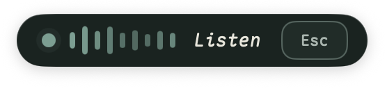
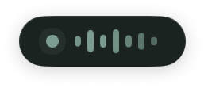
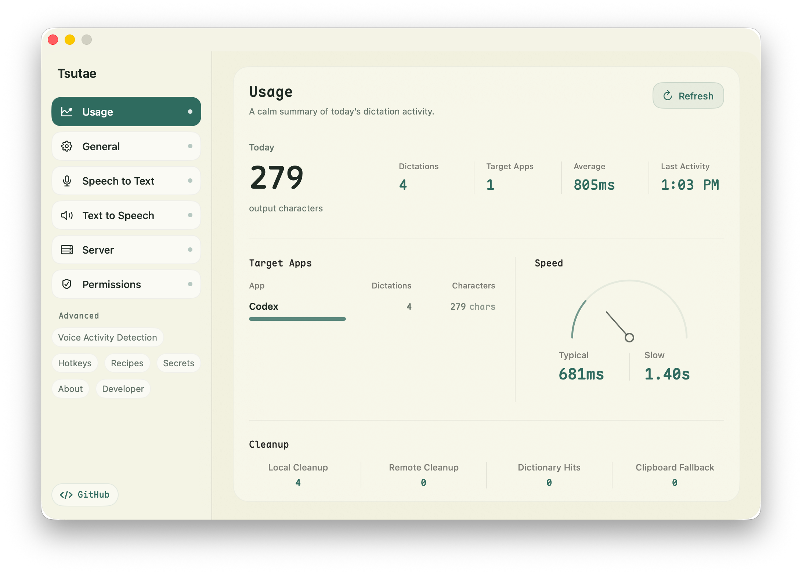
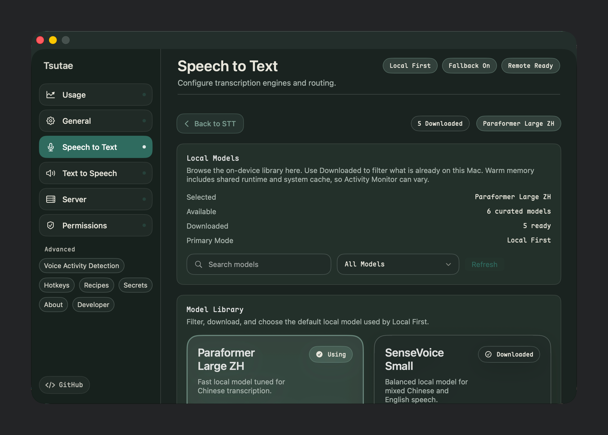

# Tsutae

Voice input, speech playback, and local automation for macOS.

Tsutae is a macOS menu-bar app for turning speech into text, speaking text back through local or remote TTS, and exposing a localhost API for tools such as Codex, Kanade, Raycast, or custom workflows.

## Status

Alpha. The core STT, TTS, settings, and local server flows are usable, but the product and API are still changing.

Current focus:

- Speech to Text with local and remote routes.
- Text to Speech with Apple TTS, remote OpenAI-compatible APIs, and local FluidAudio Kokoro voices.
- A localhost server for STT, TTS, notifications, app-scoped tokens, and per-client hooks.
- macOS companion capsules for recording, warmup, errors, and speaking state.

Planned or incomplete:

- `/v1/listen` live-listening control.
- More complete public docs and release packaging.
- Broader model coverage and more production hardening around local model residency.
- Signed and notarized release packages. For now, build from source.

## App

- Menu-bar app with a settings window.
- Global hotkey recording flow.
- Recording capsule with standard/minimal presentation.
- TTS speaking capsule shared by local playback and server-triggered speech.
- Settings for STT, TTS, server clients, permissions, developer probes, recipes, secrets, and hotkeys.

## Screenshots

<table>
  <tr>
    <td align="center" width="50%">
      
    </td>
    <td align="center" width="50%">
      
    </td>
  </tr>
  <tr>
    <td align="center"><sub>Standard recording capsule, light</sub></td>
    <td align="center"><sub>Standard recording capsule, dark</sub></td>
  </tr>
  <tr>
    <td align="center" width="50%">
      
    </td>
    <td align="center" width="50%">
      
    </td>
  </tr>
  <tr>
    <td align="center"><sub>Minimal recording capsule, light</sub></td>
    <td align="center"><sub>Minimal recording capsule, dark</sub></td>
  </tr>
</table>

<table>
  <tr>
    <td width="50%">
      
    </td>
    <td width="50%">
      
    </td>
  </tr>
  <tr>
    <td align="center"><sub>Usage dashboard, light</sub></td>
    <td align="center"><sub>STT settings, dark</sub></td>
  </tr>
</table>

## Local Server

Default bind: `http://127.0.0.1:1338`

Main endpoints:

- `GET /health`
- `GET /v1/state`
- `GET /v1/models`
- `GET /v1/tts/voices`
- `POST /v1/audio/transcriptions`
- `POST /v1/audio/speech`
- `POST /v1/speak`
- `POST /v1/notify`
- `POST /v1/stop`

Token auth can be enabled in Settings > Server. Tokens are issued per client and can be scoped to specific APIs. See [Server API](docs/server-api.md) for parameters and examples.

## Install From Source

Signed and notarized release packages are not published yet. Build Tsutae locally from source.

Requirements:

- macOS with Xcode installed.
- Swift toolchain available from `xcodebuild` / `swift`.
- [`just`](https://github.com/casey/just) for the repo command shortcuts.

Clone and build:

```bash
git clone https://github.com/yanfch/tsutae.git
cd tsutae
just build
```

Run the development app:

```bash
just restart
```

`just restart` builds the app, copies it to `dist/Tsutae.app`, kills any existing Tsutae process, and launches the new build.

The first run may ask for:

- Microphone permission for recording.
- Speech Recognition permission if Apple Speech is used as a fallback.
- Accessibility permission for focused-app text insertion and global hotkey flows.

If macOS blocks the local build, open it from Finder once or allow it in System Settings > Privacy & Security.

## First Setup

1. Open Tsutae from the menu bar.
2. Open Settings.
3. Choose an STT route:
   - Local models for offline transcription.
   - OpenAI-compatible remote STT if you already have a compatible endpoint.
4. Choose a TTS route if you want speech playback.
5. Configure the global hotkey in Settings > General.
6. Optional: enable the local server in Settings > Server and create a client token.

Remote API keys and hook tokens are stored in macOS Keychain. Tsutae config files store references or hashes, not the secret values.

## Development

Common commands:

- `just build` builds the macOS app.
- `just build-core` builds `TsutaeCore`.
- `just test-core` runs the SwiftPM core tests.
- `just restart` rebuilds and relaunches the development app.
- `just logs` tails Tsutae logs.

## Configuration

See [Configuration](docs/configuration.md).

The sandboxed macOS app writes configuration and logs under:

```text
~/Library/Containers/dev.yanfch.Tsutae/Data/.tsutae/
```

Command-line tools and tests outside the app sandbox use:

```text
~/.tsutae/
```

Useful runtime files:

- `config.yml`: app configuration.
- `hotkeys.yml`: global hotkey configuration.
- `logs/stt-perf.log`: runtime diagnostics.
- `logs/asr-samples.jsonl`: optional ASR sample log.

Tail diagnostics:

```bash
just logs
```

## Layout

```text
tsutae/
├── App/
│   └── Tsutae/
│       ├── Tsutae.xcodeproj
│       └── Tsutae/
│           ├── TsutaeApp.swift
│           ├── Views/
│           ├── Assets.xcassets/
│           └── zh-Hans.lproj/
├── Packages/
│   └── TsutaeCore/
│       ├── Package.swift
│       └── Sources/TsutaeCore/
│           ├── Audio/
│           ├── Config/
│           ├── Core/
│           ├── Engines/
│           ├── Server/
│           ├── STT/
│           └── TTS/
└── docs/
    ├── configuration.md
    ├── server-api.md
    └── README.md
```

## Feedback

Open issues or product feedback on [GitHub](https://github.com/yanfch/tsutae/issues).

## License

[MIT](LICENSE)
